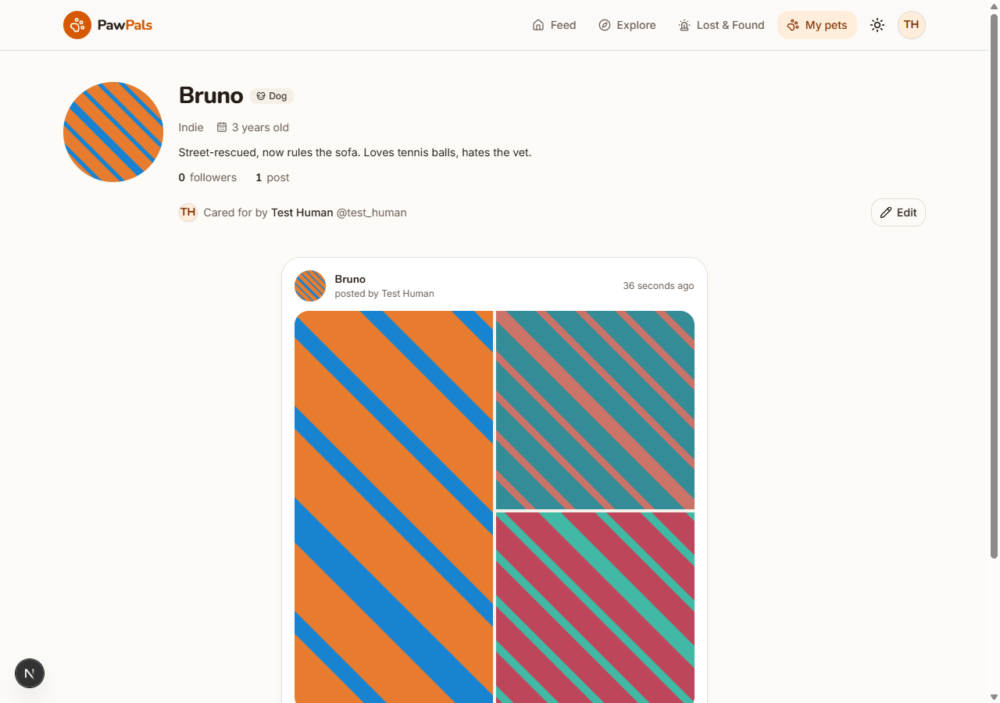
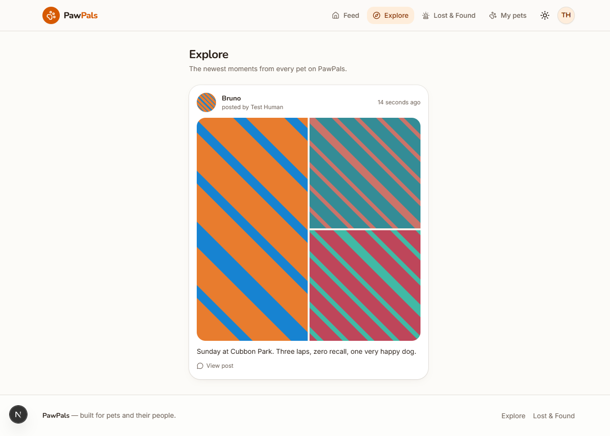
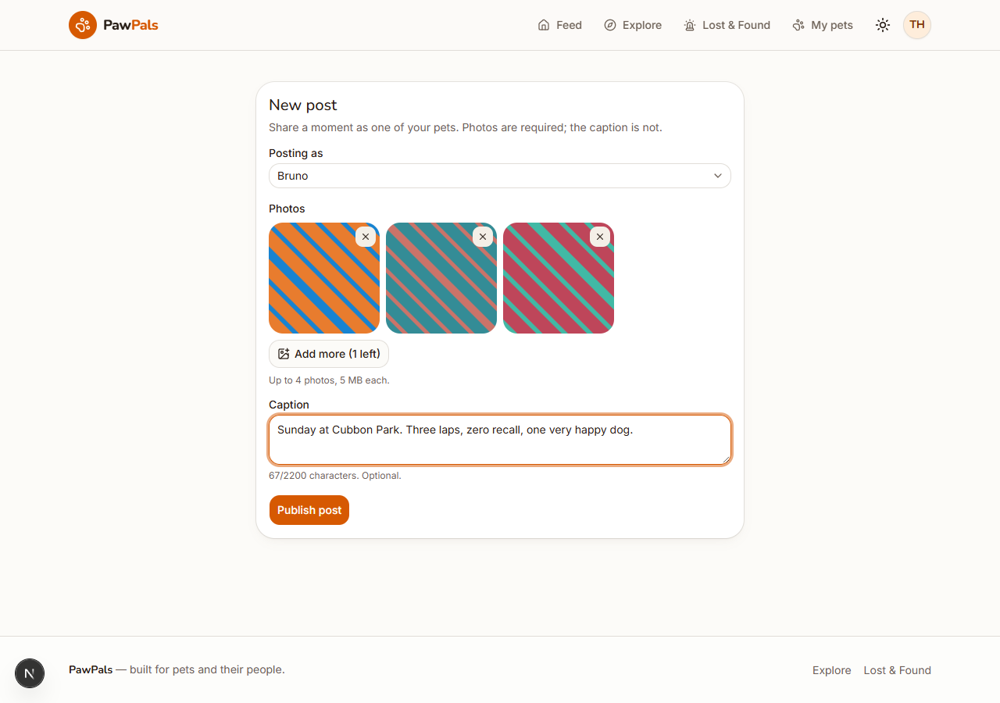
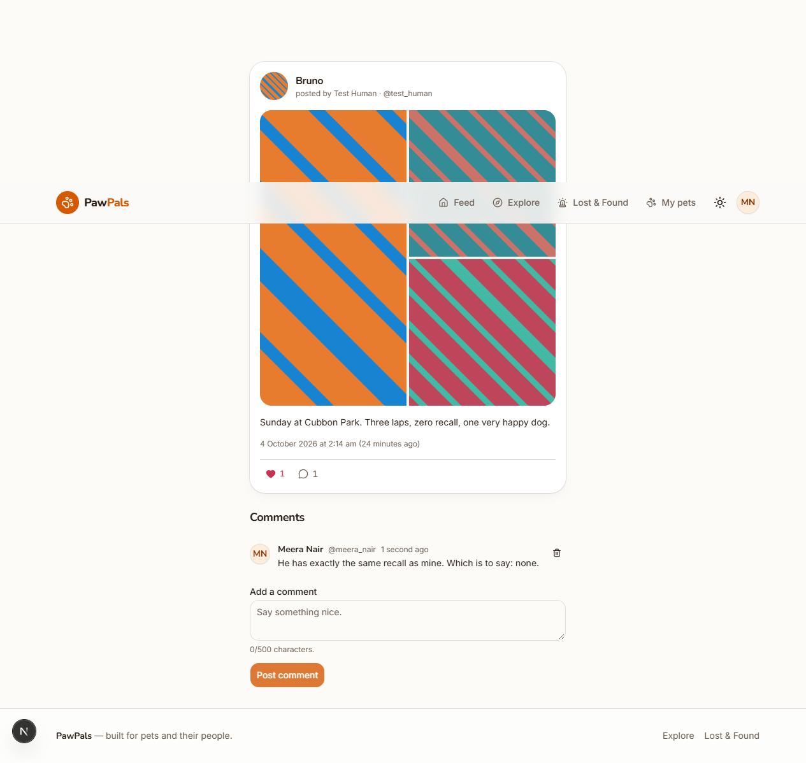
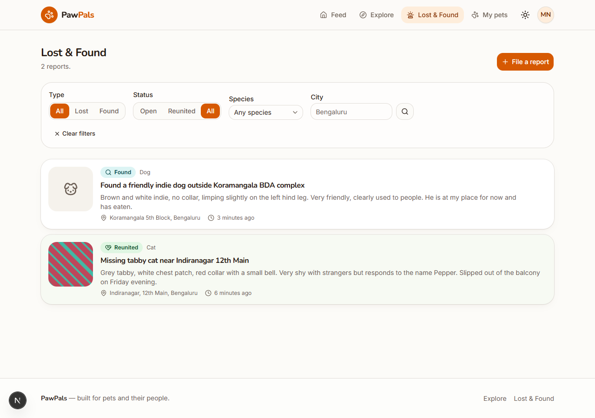
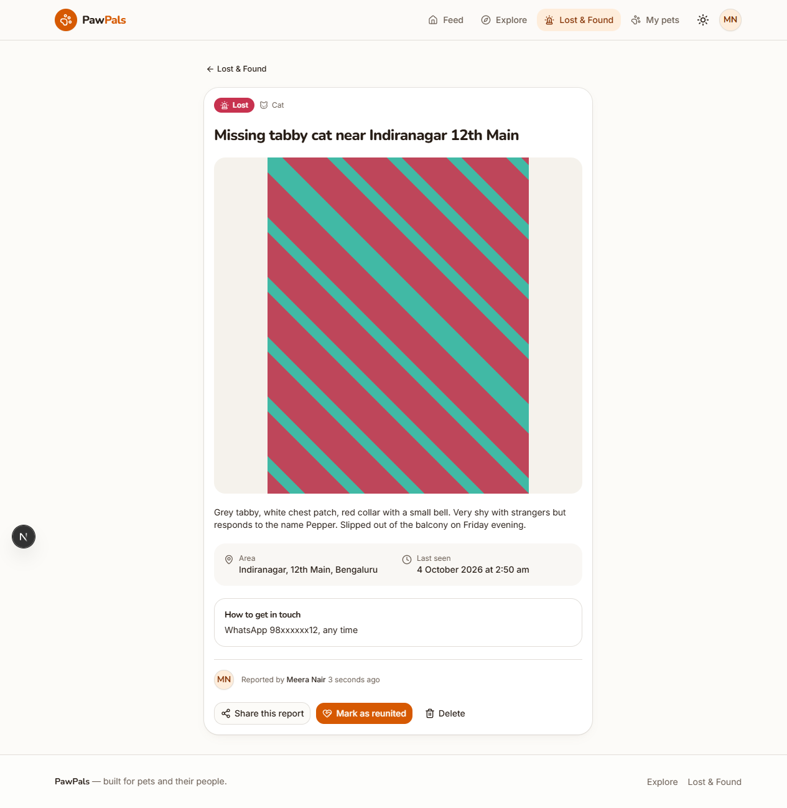
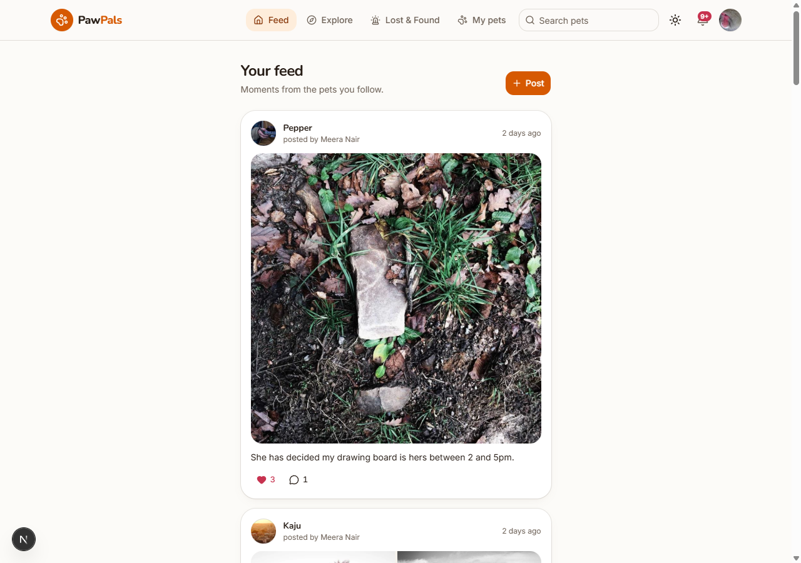
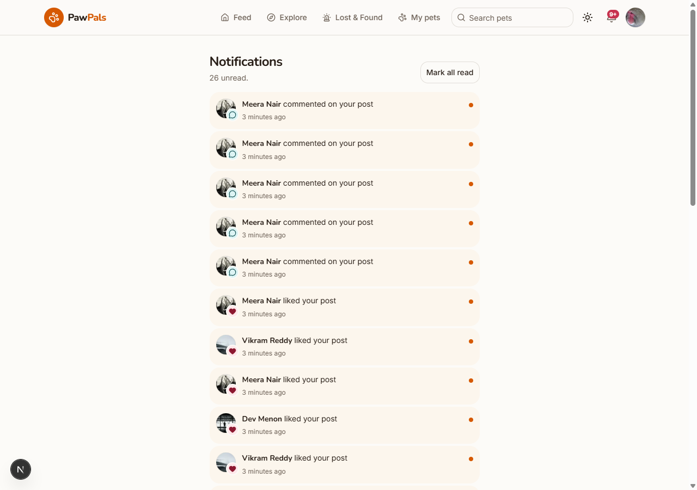
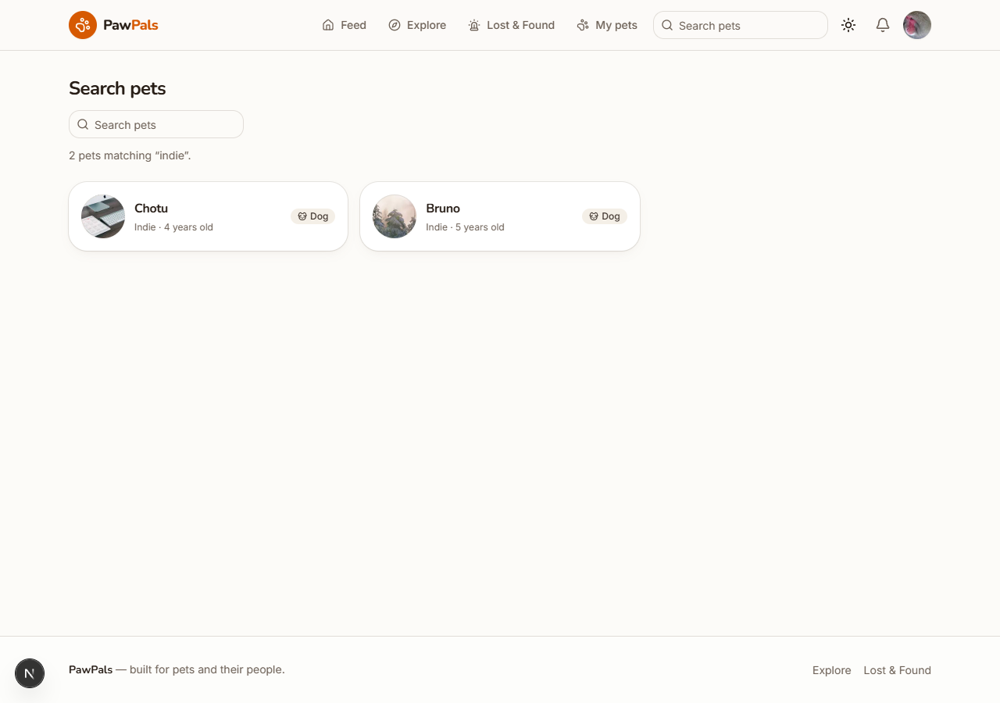

# 🐾 Pawdosi

**Every animal on your street is somebody's neighbour.**

_Pawdosi_ — paw + **padosi** (पड़ोसी), Hindi for neighbour.

Pawdosi is a social community where the **animal is the profile**. Give your pet
a profile of its own — or the street dog outside the shop who already has a name
and four people feeding her. Post as them, follow the ones you like, and help
find them when they go missing. That last part is the signature feature the big
photo apps have no answer for: a neighbourhood **Lost & Found** board, readable
without an account, because the person who recognises the dog probably does not
have one.

> Status: **live**. All six build phases are done and the app is deployed.
> See [Roadmap](#roadmap).

🔗 **Live:** <https://pawdosi.vercel.app> ·
**Source:** <https://github.com/gittam06/pawdosi>

---

## Screenshots

| Home — light                         | Home — dark                         |
| ------------------------------------ | ----------------------------------- |
|  |  |

| Pet profile                           | Explore                           |
| ------------------------------------- | --------------------------------- |
|  |  |

| Composer                           | Post detail                           |
| ---------------------------------- | ------------------------------------- |
|  |  |

| Lost &amp; Found board               | Report detail                           |
| ------------------------------------ | --------------------------------------- |
|  |  |

| Feed                           | Notifications                           |
| ------------------------------ | --------------------------------------- |
|  |  |

| Search                           | Mobile                                |
| -------------------------------- | ------------------------------------- |
|  |  |

---

## Features

**Shipped**

- Responsive app shell: sticky header, desktop nav, mobile bottom tab bar
- Custom design system (OKLCH palette, Inter + Nunito, token-driven radii and
  shadows) with full light/dark support
- Accessible foundations: skip link, landmarks, visible focus rings,
  `prefers-reduced-motion`
- Supabase server / browser / proxy clients wired for cookie-based auth
- Zod-validated environment access
- Email/password signup and sign-in, with email confirmation and an optional
  Google provider behind a feature flag
- Onboarding step for username and city; profiles auto-created by a database
  trigger on signup
- Protected routes in the proxy, plus typed `requireUser()` /
  `requireOnboardedProfile()` guards in pages
- Profile editing and avatar uploads: signed direct-to-Cloudinary upload,
  server-side asset verification, old assets deleted on replace
- Pet profiles: create, edit and delete, up to 20 per owner, with species,
  breed, birthday, gender and bio
- Public pet pages at `/pets/[slug]` with per-pet Open Graph metadata; slugs
  are stable, so a shared link survives a rename
- Posts as a pet with 1–4 images and a caption; images upload before publish,
  and a failed publish cleans up every asset it accepted
- Home feed from followed pets, Explore for everyone, and per-pet grids, all
  on keyset (cursor) pagination rather than offset
- Post detail pages with Open Graph images, and post deletion that removes the
  Cloudinary assets with it
- Likes and follows with optimistic UI that reverts itself on failure
- Comments, deletable by their author **or** by the post's author
- Like, comment and follower counts come from PostgREST aggregate embeds — one
  round trip per page, no denormalised counters to drift
- **Lost & Found**: lost or found reports with a photo, area and last-seen
  time, filtered by city, species, type and status. Filters live in the query
  string, so a filtered board is a link you can paste into a neighbourhood
  group. Open lost reports are visually prominent; reunited ones are
  celebrated rather than hidden. Reports are readable signed-out, because the
  person who recognises the animal may not have an account.
- Notifications for likes, comments and follows, with an unread badge. Written
  by database triggers rather than by the app, so they cannot be forged or
  forgotten — and un-liking withdraws its own notification.
- Pet search by name or breed
- Infinite scroll on every list, with the "Load more" button kept for keyboard
  and no-JavaScript use
- `sitemap.xml` and `robots.txt`, plus per-page Open Graph images for pets,
  posts and reports
- Seed script with demo owners, pets, posts, follows, likes, comments and a
  populated Lost &amp; Found board
- Unit tests (Vitest) and an end-to-end journey test (Playwright)

---

## Tech stack

| Area       | Choice                                                      |
| ---------- | ----------------------------------------------------------- |
| Framework  | Next.js 16 (App Router, React Server Components, TS strict) |
| Database   | Supabase Postgres with Row Level Security                   |
| Auth       | Supabase Auth via `@supabase/ssr` (cookie sessions)         |
| Images     | Cloudinary — signed direct uploads, transformed delivery    |
| Styling    | Tailwind CSS v4 + shadcn/ui (custom theme), lucide icons    |
| Validation | Zod, on the server as well as the client                    |
| Hosting    | Vercel                                                      |

Design rationale — palette, typography, spacing, component patterns — is
documented in [`docs/DESIGN.md`](docs/DESIGN.md).

---

## Database

All tables use `uuid` primary keys, `created_at timestamptz default now()`, and
have **RLS enabled**: public read for social content, writes restricted to the
owning `auth.uid()`.

```
profiles ──1:N──> pets ──1:N──> posts ──1:N──> post_images
   │                 ▲             │
   │                 │             ├──1:N──> likes      (user_id + post_id PK)
   │                 │             └──1:N──> comments
   │                 │
   ├──N:M────────────┘   follows (follower_id + pet_id PK)  ← users follow PETS
   │
   ├──1:N──> lost_found_reports   (type: lost|found, status: open|reunited)
   └──1:N──> notifications        (like | comment | follow, read_at)
```

| Table                | Purpose                                                               |
| -------------------- | --------------------------------------------------------------------- |
| `profiles`           | One per auth user; username, display name, city, bio, avatar          |
| `pets`               | The actual social profile: name, unique slug, species, breed, bio     |
| `posts`              | A moment posted _as_ one of your pets                                 |
| `post_images`        | 1–4 Cloudinary images per post, ordered by `position`                 |
| `likes` / `comments` | Interactions on a post                                                |
| `follows`            | A user follows a **pet**, not a user                                  |
| `lost_found_reports` | Lost/found reports scoped by city + locality, with a `reunited` state |
| `notifications`      | Likes, comments and follows for the recipient only                    |

Indexes target the real queries: posts by `(pet_id, created_at)`, follows by
`follower_id`, reports by `(city, status, created_at)`.

Migrations live in `supabase/migrations/`. TypeScript types are generated, never
hand-written:

```bash
npm run db:types   # supabase gen types typescript --linked
```

---

## Local setup

**Prerequisites:** Node.js 20+, npm, a free Supabase project, a free Cloudinary
account.

```bash
# 1. Install
npm install

# 2. Configure
cp .env.example .env.local   # then fill in the values

# 3. Apply migrations — either link the CLI:
npx supabase link --project-ref <your-project-ref>
npx supabase db push
#    …or paste the contents of supabase/migrations/*.sql into the
#    Supabase SQL editor, in filename order.

# 4. Generate database types
npm run db:types

# 5. Run
npm run dev                  # http://localhost:3000
```

### Supabase dashboard settings

Two things are configured outside the migrations:

1. **Authentication → URL Configuration** — set the Site URL to your
   deployment, and add `http://localhost:3000/auth/callback` plus
   `https://<your-domain>/auth/callback` as redirect URLs. Without these the
   confirmation link bounces to `/auth/error`.
2. **Google sign-in** — three steps, in this order:
   1. Google Cloud Console → **APIs & Services → Credentials → Create OAuth
      client ID → Web application**. Add
      `https://<project-ref>.supabase.co/auth/v1/callback` as an authorised
      redirect URI. Google, not Supabase, owns this redirect.
   2. Supabase → **Authentication → Providers → Google**: enable it and paste
      the client ID and secret.
   3. Set `NEXT_PUBLIC_ENABLE_GOOGLE_AUTH=true` to show the button.

   With the flag on but the provider not yet configured, the button reports
   "Google sign-in is not configured yet" rather than failing silently.

Email confirmation is on by default. With it off, signup signs the user in
immediately and skips the "check your inbox" screen — both paths are handled.

Without `.env.local` the dev server still renders the UI — the session refresh
logs a warning and is skipped — but anything touching auth or uploads will fail
with an explicit message.

### Scripts

| Script               | What it does                           |
| -------------------- | -------------------------------------- |
| `npm run dev`        | Dev server (Turbopack)                 |
| `npm run build`      | Production build, fails on type errors |
| `npm run typecheck`  | `tsc --noEmit`                         |
| `npm run lint`       | ESLint                                 |
| `npm run format`     | Prettier (with Tailwind class sorting) |
| `npm run db:types`   | Regenerate `src/lib/supabase/types.ts` |
| `npm test`           | Unit tests (Vitest)                    |
| `npm run test:e2e`   | End-to-end journey (Playwright)        |
| `npm run seed`       | Add demo data                          |
| `npm run seed:reset` | Remove previous demo data, then re-add |
| `npm run seed:clean` | Remove demo data and stop              |

### Demo data

```bash
npm run seed:reset      # wipes previously seeded accounts, then seeds
npm run seed:clean      # wipes them and stops — for a clean public launch
```

Seeded owners sign in with `<username>@pawdosi-demo.local` and the password
printed by the script — for example `aarav_s@pawdosi-demo.local`. `--reset`
only ever touches accounts on that domain, and deletes their Cloudinary assets
along with them.

Source images come from Lorem Picsum, which is licence-free and deterministic.
Swap `sourceImage` in `scripts/seed.mts` for real pet photography before taking
portfolio screenshots.

### Tests

`npm test` is pure unit tests — slugs, ages, and the Zod schemas — and needs
nothing running.

`npm run test:e2e` drives a real browser against a real Supabase project, so it
needs `.env.local` (the config loads it) and will start the dev server itself.
It signs up, onboards, creates a pet, posts, and checks the post appears on the
pet's page, then deletes the account it created.

---

## Environment variables

| Variable                            | Scope      | Notes                                        |
| ----------------------------------- | ---------- | -------------------------------------------- |
| `NEXT_PUBLIC_SUPABASE_URL`          | public     | Supabase project URL                         |
| `NEXT_PUBLIC_SUPABASE_ANON_KEY`     | public     | Anon key; safe because RLS is enforced       |
| `SUPABASE_SERVICE_ROLE_KEY`         | **server** | Bypasses RLS — seed script only              |
| `NEXT_PUBLIC_CLOUDINARY_CLOUD_NAME` | public     | Cloud name for delivery URLs                 |
| `CLOUDINARY_API_KEY`                | server     | Used to sign uploads                         |
| `CLOUDINARY_API_SECRET`             | **server** | Must never reach the browser                 |
| `NEXT_PUBLIC_SITE_URL`              | public     | Absolute base URL for metadata and redirects |
| `NEXT_PUBLIC_ENABLE_GOOGLE_AUTH`    | public     | `"true"` shows the Google sign-in button     |

Access goes through `src/lib/env.ts`, which validates with Zod and fails with a
readable message instead of `undefined` sneaking into a request.

---

## Project structure

```
src/
├── actions/              # Server Actions (auth, profile) — all Zod-validated
├── app/
│   ├── (auth)/           # sign-in, sign-up, check-email (signed-out only)
│   ├── api/cloudinary/   # upload signing endpoint
│   ├── auth/             # OAuth + email confirmation callback, error page
│   ├── onboarding/       # username + city step
│   └── settings/         # profile editing
├── components/
│   ├── auth/             # Google button
│   ├── brand/            # logo
│   ├── forms/            # field, password, submit-button, form-alert
│   ├── layout/           # header, footer, navs, user menu
│   ├── upload/           # avatar uploader
│   └── ui/               # shadcn primitives (themed, not restyled ad hoc)
├── config/               # site metadata, navigation, feature flags
├── lib/
│   ├── auth.ts           # cached session helpers and route guards
│   ├── cloudinary.ts     # signing, verification, deletion (server only)
│   ├── env.ts            # Zod-validated environment access
│   ├── supabase/         # server, browser and proxy clients + generated types
│   └── validations/      # Zod schemas shared by forms and actions
└── proxy.ts              # session refresh + route protection
supabase/migrations/      # SQL migrations
docs/DESIGN.md            # the design system
```

---

## Deploying to Vercel

The app is deployment-ready; these are the steps, in order.

**1. Push to GitHub**

```bash
git remote add origin https://github.com/<you>/pawdosi.git
git push -u origin main
```

**2. Import the repo on Vercel** — framework detection handles the rest; there
is no build configuration to add.

**3. Set the environment variables** on the Vercel project (Settings →
Environment Variables), for Production _and_ Preview:

| Variable                            | Value                                       |
| ----------------------------------- | ------------------------------------------- |
| `NEXT_PUBLIC_SUPABASE_URL`          | same as local                               |
| `NEXT_PUBLIC_SUPABASE_ANON_KEY`     | same as local                               |
| `SUPABASE_SERVICE_ROLE_KEY`         | same as local — **never** `NEXT_PUBLIC_`    |
| `NEXT_PUBLIC_CLOUDINARY_CLOUD_NAME` | same as local                               |
| `CLOUDINARY_API_KEY`                | same as local                               |
| `CLOUDINARY_API_SECRET`             | same as local                               |
| `NEXT_PUBLIC_SITE_URL`              | `https://<your-domain>` — **not** localhost |

`NEXT_PUBLIC_SITE_URL` is the one that is easy to forget. It is the
`metadataBase` behind every Open Graph image, so leaving it as localhost makes
every shared link preview break.

**4. Point Supabase at the deployment** — Authentication → URL Configuration:
set the Site URL to the production domain and add
`https://<your-domain>/auth/callback` to the redirect URLs. Without this,
confirmation links bounce to `/auth/error`.

**5. If Google sign-in is on**, add
`https://<project-ref>.supabase.co/auth/v1/callback` to the authorised redirect
URIs in Google Cloud Console — and move the OAuth consent screen out of Testing
mode, or only listed test users will be able to sign in.

**6. Decide about demo data.** `npm run seed` against the production project
fills the site with content for a portfolio visitor; `npm run seed:clean`
leaves it empty. Either is a one-command change.

Migrations are applied with `npx supabase db push` against the linked project —
they are not run by the Vercel build.

---

## Roadmap

- [x] **Phase 0** — scaffold, design tokens, Supabase clients, app shell
- [x] **Phase 1** — auth, onboarding, profile editing, avatar uploads
- [x] **Phase 2** — pet profiles, public pet pages
- [x] **Phase 3** — posts, home feed, Explore, cursor pagination
- [x] **Phase 4** — likes, comments, follows, counts
- [x] **Phase 5** — Lost & Found board, filters, reunited state
- [x] **Phase 6** — notifications, search, infinite scroll, SEO, seed data,
      tests
