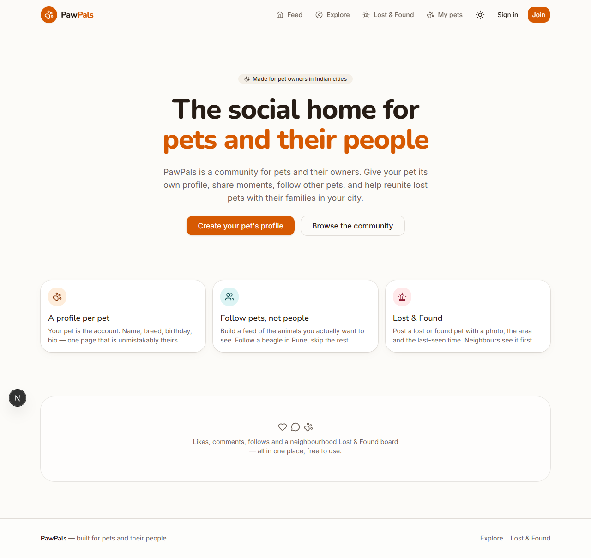
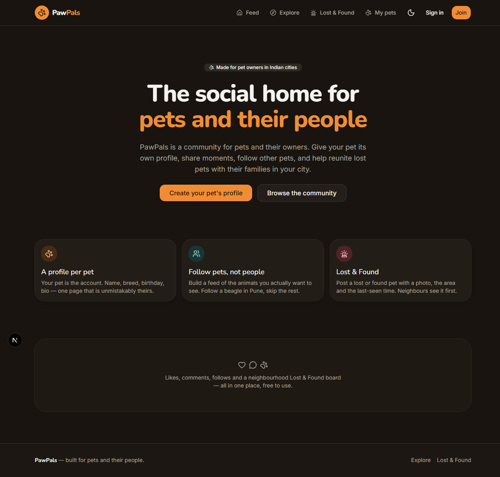
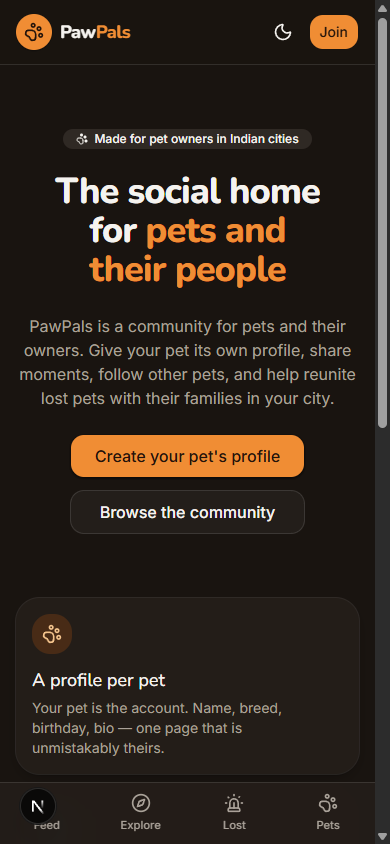

# 🐾 PawPals

**The social home for pets and their people.**

PawPals is a social community where the **pet is the profile**. Owners create a
profile for each of their pets, share photos and moments, follow other pets, and
like and comment. Its signature feature is something the big photo apps do not
have: a neighbourhood **Lost & Found** board for reuniting lost pets with their
families.

> Status: **Phase 2 complete** — design system, app shell, authentication, and
> pet profiles with public pages. See [Roadmap](#roadmap).

🔗 **Live demo:** _coming soon_

---

## Screenshots

| Home — light                         | Home — dark                         |
| ------------------------------------ | ----------------------------------- |
|  |  |

| Mobile                                | Pet profile · Lost & Found |
| ------------------------------------- | -------------------------- |
|  | _coming in Phases 2 and 5_ |

---

## Features

**Shipped**

- Responsive app shell: sticky header, desktop nav, mobile bottom tab bar
- Custom design system (OKLCH palette, Inter + Nunito, token-driven radii and
  shadows) with full light/dark support
- Accessible foundations: skip link, landmarks, visible focus rings,
  `prefers-reduced-motion`
- Supabase server / browser / proxy clients wired for cookie-based auth
- Zod-validated environment access
- Email/password signup and sign-in, with email confirmation and an optional
  Google provider behind a feature flag
- Onboarding step for username and city; profiles auto-created by a database
  trigger on signup
- Protected routes in the proxy, plus typed `requireUser()` /
  `requireOnboardedProfile()` guards in pages
- Profile editing and avatar uploads: signed direct-to-Cloudinary upload,
  server-side asset verification, old assets deleted on replace
- Pet profiles: create, edit and delete, up to 20 per owner, with species,
  breed, birthday, gender and bio
- Public pet pages at `/pets/[slug]` with per-pet Open Graph metadata; slugs
  are stable, so a shared link survives a rename

**Planned**

- Posts with 1–4 Cloudinary images, home feed from followed pets, Explore
- Likes (optimistic), comments, follow/unfollow pets
- Lost & Found reports with photo, area, last-seen time, filters and a
  shareable detail page, markable as _Reunited_
- Notifications, pet search, infinite scroll, SEO + Open Graph images

---

## Tech stack

| Area       | Choice                                                      |
| ---------- | ----------------------------------------------------------- |
| Framework  | Next.js 16 (App Router, React Server Components, TS strict) |
| Database   | Supabase Postgres with Row Level Security                   |
| Auth       | Supabase Auth via `@supabase/ssr` (cookie sessions)         |
| Images     | Cloudinary — signed direct uploads, transformed delivery    |
| Styling    | Tailwind CSS v4 + shadcn/ui (custom theme), lucide icons    |
| Validation | Zod, on the server as well as the client                    |
| Hosting    | Vercel                                                      |

Design rationale — palette, typography, spacing, component patterns — is
documented in [`docs/DESIGN.md`](docs/DESIGN.md).

---

## Database

All tables use `uuid` primary keys, `created_at timestamptz default now()`, and
have **RLS enabled**: public read for social content, writes restricted to the
owning `auth.uid()`.

```
profiles ──1:N──> pets ──1:N──> posts ──1:N──> post_images
   │                 ▲             │
   │                 │             ├──1:N──> likes      (user_id + post_id PK)
   │                 │             └──1:N──> comments
   │                 │
   ├──N:M────────────┘   follows (follower_id + pet_id PK)  ← users follow PETS
   │
   ├──1:N──> lost_found_reports   (type: lost|found, status: open|reunited)
   └──1:N──> notifications        (like | comment | follow, read_at)
```

| Table                | Purpose                                                               |
| -------------------- | --------------------------------------------------------------------- |
| `profiles`           | One per auth user; username, display name, city, bio, avatar          |
| `pets`               | The actual social profile: name, unique slug, species, breed, bio     |
| `posts`              | A moment posted _as_ one of your pets                                 |
| `post_images`        | 1–4 Cloudinary images per post, ordered by `position`                 |
| `likes` / `comments` | Interactions on a post                                                |
| `follows`            | A user follows a **pet**, not a user                                  |
| `lost_found_reports` | Lost/found reports scoped by city + locality, with a `reunited` state |
| `notifications`      | Likes, comments and follows for the recipient only                    |

Indexes target the real queries: posts by `(pet_id, created_at)`, follows by
`follower_id`, reports by `(city, status, created_at)`.

Migrations live in `supabase/migrations/`. TypeScript types are generated, never
hand-written:

```bash
npm run db:types   # supabase gen types typescript --linked
```

---

## Local setup

**Prerequisites:** Node.js 20+, npm, a free Supabase project, a free Cloudinary
account.

```bash
# 1. Install
npm install

# 2. Configure
cp .env.example .env.local   # then fill in the values

# 3. Apply migrations — either link the CLI:
npx supabase link --project-ref <your-project-ref>
npx supabase db push
#    …or paste the contents of supabase/migrations/*.sql into the
#    Supabase SQL editor, in filename order.

# 4. Generate database types
npm run db:types

# 5. Run
npm run dev                  # http://localhost:3000
```

### Supabase dashboard settings

Two things are configured outside the migrations:

1. **Authentication → URL Configuration** — set the Site URL to your
   deployment, and add `http://localhost:3000/auth/callback` plus
   `https://<your-domain>/auth/callback` as redirect URLs. Without these the
   confirmation link bounces to `/auth/error`.
2. **Authentication → Providers → Google** _(optional)_ — enable it, then set
   `NEXT_PUBLIC_ENABLE_GOOGLE_AUTH=true` to show the button.

Email confirmation is on by default. With it off, signup signs the user in
immediately and skips the "check your inbox" screen — both paths are handled.

Without `.env.local` the dev server still renders the UI — the session refresh
logs a warning and is skipped — but anything touching auth or uploads will fail
with an explicit message.

### Scripts

| Script              | What it does                           |
| ------------------- | -------------------------------------- |
| `npm run dev`       | Dev server (Turbopack)                 |
| `npm run build`     | Production build, fails on type errors |
| `npm run typecheck` | `tsc --noEmit`                         |
| `npm run lint`      | ESLint                                 |
| `npm run format`    | Prettier (with Tailwind class sorting) |
| `npm run db:types`  | Regenerate `src/lib/supabase/types.ts` |

---

## Environment variables

| Variable                            | Scope      | Notes                                        |
| ----------------------------------- | ---------- | -------------------------------------------- |
| `NEXT_PUBLIC_SUPABASE_URL`          | public     | Supabase project URL                         |
| `NEXT_PUBLIC_SUPABASE_ANON_KEY`     | public     | Anon key; safe because RLS is enforced       |
| `SUPABASE_SERVICE_ROLE_KEY`         | **server** | Bypasses RLS — seed script only              |
| `NEXT_PUBLIC_CLOUDINARY_CLOUD_NAME` | public     | Cloud name for delivery URLs                 |
| `CLOUDINARY_API_KEY`                | server     | Used to sign uploads                         |
| `CLOUDINARY_API_SECRET`             | **server** | Must never reach the browser                 |
| `NEXT_PUBLIC_SITE_URL`              | public     | Absolute base URL for metadata and redirects |
| `NEXT_PUBLIC_ENABLE_GOOGLE_AUTH`    | public     | `"true"` shows the Google sign-in button     |

Access goes through `src/lib/env.ts`, which validates with Zod and fails with a
readable message instead of `undefined` sneaking into a request.

---

## Project structure

```
src/
├── actions/              # Server Actions (auth, profile) — all Zod-validated
├── app/
│   ├── (auth)/           # sign-in, sign-up, check-email (signed-out only)
│   ├── api/cloudinary/   # upload signing endpoint
│   ├── auth/             # OAuth + email confirmation callback, error page
│   ├── onboarding/       # username + city step
│   └── settings/         # profile editing
├── components/
│   ├── auth/             # Google button
│   ├── brand/            # logo
│   ├── forms/            # field, password, submit-button, form-alert
│   ├── layout/           # header, footer, navs, user menu
│   ├── upload/           # avatar uploader
│   └── ui/               # shadcn primitives (themed, not restyled ad hoc)
├── config/               # site metadata, navigation, feature flags
├── lib/
│   ├── auth.ts           # cached session helpers and route guards
│   ├── cloudinary.ts     # signing, verification, deletion (server only)
│   ├── env.ts            # Zod-validated environment access
│   ├── supabase/         # server, browser and proxy clients + generated types
│   └── validations/      # Zod schemas shared by forms and actions
└── proxy.ts              # session refresh + route protection
supabase/migrations/      # SQL migrations
docs/DESIGN.md            # the design system
```

---

## Roadmap

- [x] **Phase 0** — scaffold, design tokens, Supabase clients, app shell
- [x] **Phase 1** — auth, onboarding, profile editing, avatar uploads
- [x] **Phase 2** — pet profiles, public pet pages
- [ ] **Phase 3** — posts and feed
- [ ] **Phase 4** — likes, comments, follows
- [ ] **Phase 5** — Lost & Found
- [ ] **Phase 6** — notifications, search, SEO, seed data, tests, deploy
